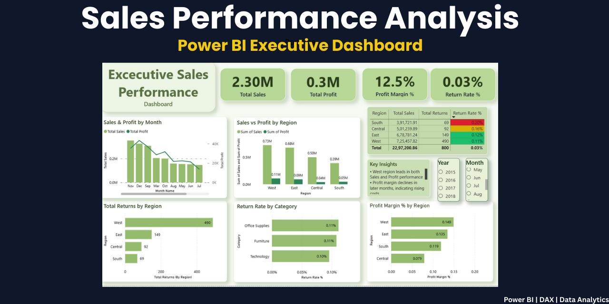
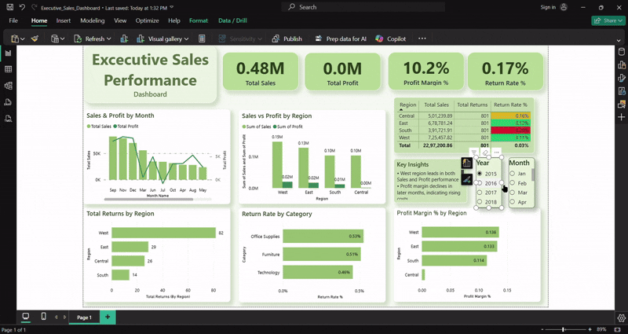
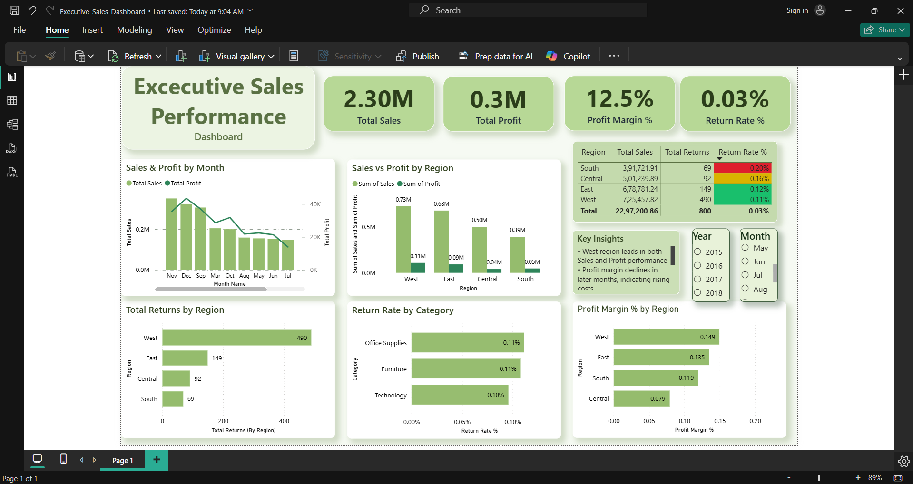
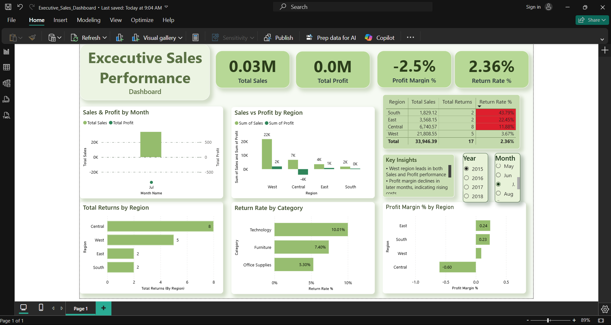

#  Sales Performance Analysis – Power BI Dashboard

#  Project Overview
This project presents an **Executive Sales Performance Dashboard** built using **Power BI** to analyze sales, profit, returns, and profitability trends across regions, categories, and time periods.

The dashboard is designed to support **data-driven business decision-making** by delivering clear KPIs, trend analysis, and actionable insights through an intuitive visual layout.

---

#  Dashboard Demo

  

 **Full Demo Video:**  
[Watch on Google Drive](https://drive.google.com/file/d/14pWeQvWjfH1g69JI8s9d5EaEqC2lVB_f/view?usp=sharing)

---

#  Objectives
- Analyze **Total Sales, Profit, Profit Margin, and Return Rate**
- Compare **Sales vs Profit across Regions**
- Track **monthly sales and profit trends**
- Identify regions and categories with **high returns**
- Provide **executive-level insights** using KPIs and interactive visuals

---

#  Tools & Technologies Used
- **Power BI Desktop**
- **DAX (Data Analysis Expressions)**
- **Microsoft Excel**
- **Git & GitHub**

---

#  Key KPIs
- **Total Sales:** 2.30M  
- **Total Profit:** 0.30M  
- **Profit Margin:** 12.5%  
- **Return Rate:** 3%

---

#  Dashboard Highlights
- **Sales & Profit by Month** (Bar + Line Chart)
- **Sales vs Profit by Region**
- **Total Returns by Region**
- **Return Rate by Category**
- **Profit Margin % by Region**
- **Interactive Slicers** (Year & Month)
- **Key Insights Panel** for executive summary

---

#  Key Insights
- West region is the **strongest contributor** to both Sales and Profit  
- Profit margins show a **gradual decline in later months**
- Technology category has the **lowest return rate**
- South region shows **lower profitability relative to sales volume**

---

#  Business Impact
- Helps leadership quickly identify high-performing and underperforming regions
- Enables data-driven decisions on profitability and returns
- Improves visibility into monthly sales and margin trends
- Reduces manual reporting effort through automated KPIs

---

#  Dashboard Snapshot

---

#  Dashboard Videos

>  *Note: GitHub does not support inline video playback in README files.*  
> Please click the links below to download and view the videos.

#  Power BI Dashboard Walkthrough
[ Download Dashboard Demo](Demo_Video/Sales_Performance_Dashboard_demo.mp4)

#  Power BI Report & DAX Walkthrough
[ Download Power BI Walkthrough](Demo_Video/PowerBI_Walkthrough.mp4)

---

#  Dataset Information
- **Dataset:** Sample Superstore  
- **Source:** Publicly available dataset  
- **Includes:**
  - Orders
  - Sales
  - Profit
  - Returns
  - Regions & Categories

---

#  How to Use This Project
1. Clone or download the repository
2. Open the `.pbix` file using **Power BI Desktop**
3. Refresh the data if required
4. Use slicers and visuals to explore insights

---

#  Learnings & Skills Demonstrated
- Power BI data modeling
- DAX calculations (KPIs, ratios, return rate)
- Dashboard design and layout best practices
- Business storytelling using data
- Version control with Git & GitHub

---

#  Project Structure

SALES_PERFORMANCE_ANALYSIS/
│
│
├── Demo_video/
│   ├── PowerBI_Walkthrough.mp4
│   └── Sales_performance_Dashboard_demo.gif
│
├── Documentation/
│   └── Project_Notes.md
│
├── Excel_Work/
│   └── Sample-Superstore.xlsx
│
├── PowerBI/
│   └── (Power BI .pbix file)
│
├── Screenshots/
│   ├── github_thumbnail.png
│   ├── dashboard_overview.png
│   ├── filters_view1.png
│   └── filters_view2.png
|__ README.md

---

#  Contact
**Bhargavi Chinnaparapu**  

 LinkedIn: https://www.linkedin.com/in/bhargavichinnaparapu  
 GitHub: https://github.com/bhargavichinnaparapu
